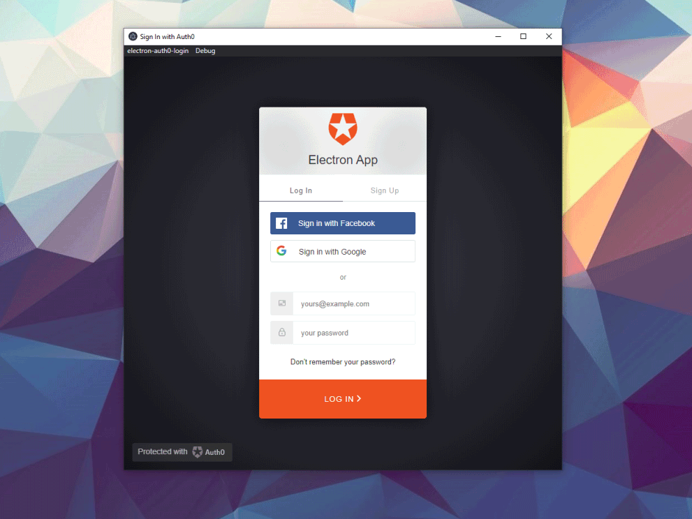

# Electron Auth0 Login

Enables Auth0 login within your Electron application, using proof-key-for-code-exchange (PKCE)

- 🔒 Uses the industry-standard PKCE flow, as [recommended](https://auth0.com/docs/flows/authorization-code-flow-with-proof-key-for-code-exchange-pkce) by Auth0 for native apps
- 🎿 Easy setup and a simple promise-based API
- 🔄 Supports refresh tokens for 'login once' functionality
- 💪 TypeScript support
- 🌍 Provided under MIT license



## 🔑 What exactly does this do?

When asked for an auth token, this library will try the following:

1. If you have a valid token in memory, and won't expire in the next 60 seconds, we return it
2. If you have a refresh token, we exchange it for a new token
3. If you have no refresh token (or have refresh tokens disabled), we open a new window with the Auth0 login page and begin a PKCE flow.

Discover more features in the [API docs](docs/api.md).

## 📖 Docs

- [Quick start guide below](#quick-start-guide-getting-auth-tokens)
- [Setup guide](docs/setup.md)
- [API docs](docs/api.md)

## New version!

💥 Version 2 now out! New features include:

- easier setup with no need for peer dependencies
- support for non-Keytar refresh token libraries
- support for future extensibility


### Problems?

If you're having problems with the latest v2 release, try `npm install electron-auth0-login@1.4.1`.

Docs for the old release are [here](https://github.com/jbreckmckye/electron-auth0-login/blob/e9ec555455ab185fc1e07a9d8e8c1c34a6f082b8/README.md).

## 🚀 Quick start guide: getting auth tokens

Install using NPM or Yarn:

```shell script
# NPM
npm install electron-auth0-login

# Yarn
yarn add electron-auth0-login
```

🚨 This library expects a peerDependency of Electron 7+

Set up an application in the Auth0 console:

- create a `native` application (not `machine-to-machine`)
- set up an "Allowed callback URL" for `https://{your auth0 domain}/mobile`

Create a file called `auth.ts`/`auth.js`:

```typescript
import { auth0Login } from 'electron-auth0-login';

// Only import this directly into your main process
// For the rendering process, use electron.remote.require()

export default auth0Login({
  // Get these values from your Auth0 application console
  auth0: {
    audience: 'url',
    clientId: 'long base64 string',
    domain: 'url',
    scopes: 'these will be custom to your application'
 }
});
```

### Getting a token

In your **main process**, you can just import the library directly:

```typescript
// In your main.ts file, or a file imported by main.ts
import { getToken } from './auth';

async function example() {
  // Example: using a bearer token
  const token = await getToken();
  apiCall({
    headers: {
      Authorization: `Bearer ${token}`
    }
  });
}
```

In the **rendering process**, you need to use `electron.remote.require`:

```typescript
import { remote } from 'electron';

const { getToken } = remote.require('./auth'); // depending where you put 'auth.ts'

async function example() {
  // Example: using a bearer token
  const token = await getToken();
  apiCall({
    headers: {
      Authorization: `Bearer ${token}`
    }
  });
}
```

For more details, including advanced options and refresh tokens, take a look at the [[Setup guide]](docs/setup.md).

Discover other methods you can call in the [[API guide]](docs/api.md).

## 🛠 Issues / contributions

Feel free to open an issue or pull request. Try to make these as detailed as possible: the more info, the easier it is to help. Example code is always good.

If you want to develop this library, just clone and `npm install`. To grok the general layout and architecture of the project, read https://github.com/jbreckmckye/node-typescript-architecture.

Check out the [electron-login-test project](https://github.com/jbreckmckye/electron-login-test) too, which will allow you to test your changes manually in an example Electron app.

## 📜 General details

This library is made available under the MIT license: see LICENSE file.

It was originally inspired by @adeperio's Electron PKCE example: https://gist.github.com/adeperio/73ce6680d4b80b45e624ab62bacfbdca

Copyright 2018-2021 Jimmy Breck-McKye.
